# 🏦 Bank Management System

A console-based **Bank Management System** developed in **C++** using **Object-Oriented Programming (OOP)** principles. The project simulates a real banking environment with different user roles, secure authentication, and file handling.

## 📌 Features

### 👤 Client
- Secure sign in
- View account information
- Deposit money
- Withdraw money
- Transfer money
- Update personal information

### 👨‍💼 Employee
- Add new clients
- Update client information
- Search for clients
- View all clients
- Delete clients

### 👨‍💻 Administrator
- Manage clients
- Manage employees
- Manage administrators
- Full system control

## 🛠️ Technologies Used

- C++
- Object-Oriented Programming (OOP)
- File Handling
- STL
- Windows Console API
- Visual Studio

## 📚 OOP Concepts Applied

- Encapsulation
- Inheritance
- Polymorphism
- Abstraction

## 📂 Project Structure

```text
Bank System/
├── Client
├── Employee
├── Admin
├── Person
├── Validation
├── DataEntry
├── FilesHelper
├── FileManager
├── Parser
├── Screens
├── LoginManager
├── ClientManager
├── EmployeeManager
├── AdminManager
└── Console
```

## 💾 Data Storage

The system stores and retrieves data using text files. All changes are saved automatically.

## 🔐 Authentication

Each user logs in using:
- ID
- Password (masked during input)

## 📷 Screenshots

### Welcome Screen
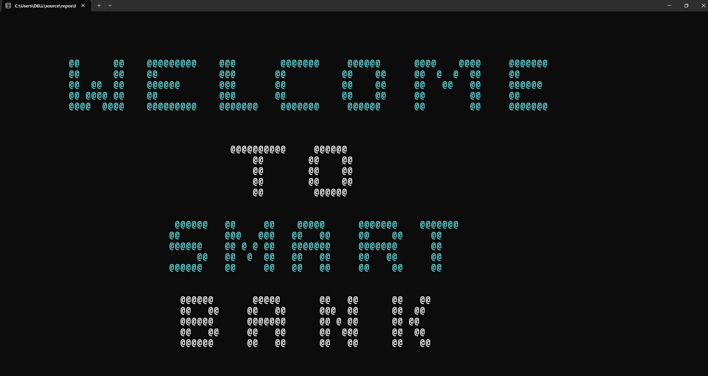

### Login
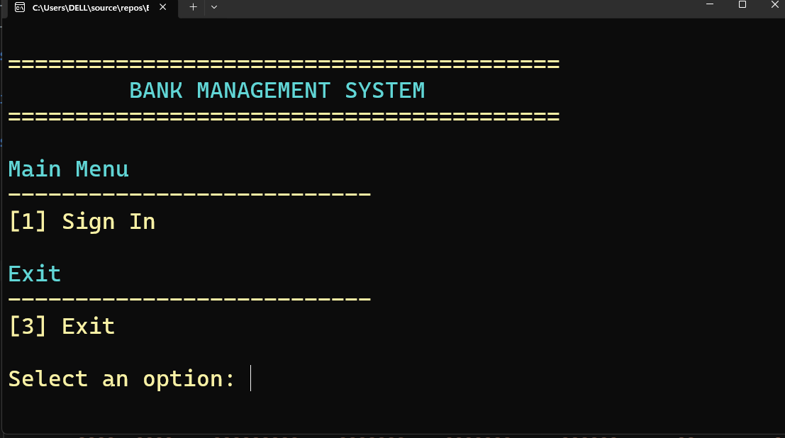
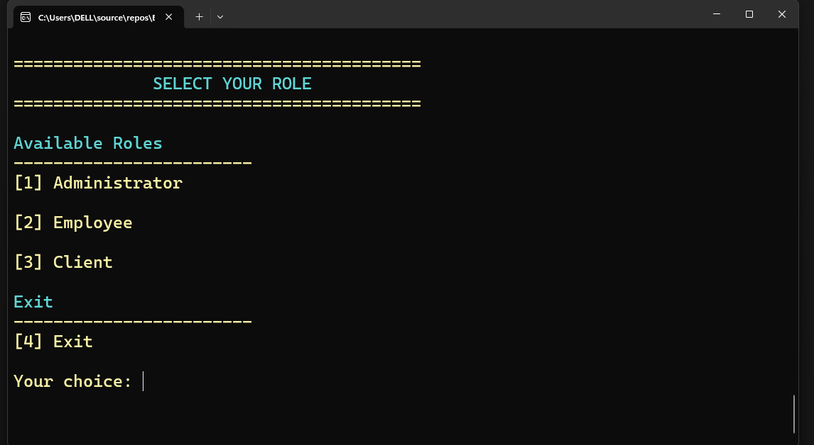

### Dashboard


### Admin Dashboard
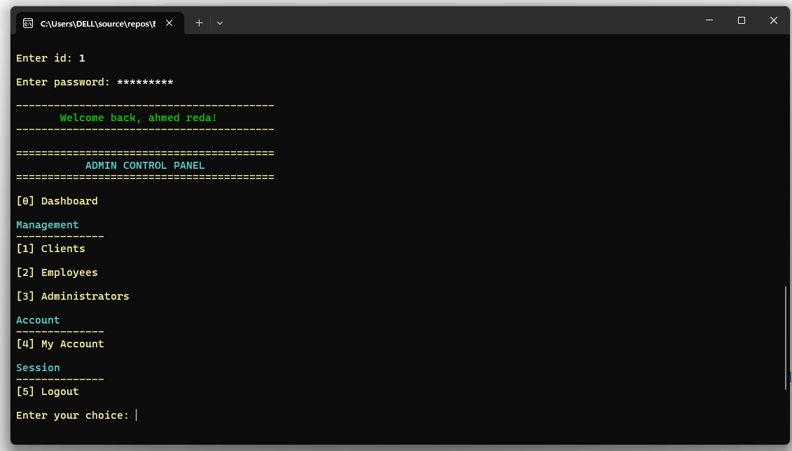

### Client Dashboard
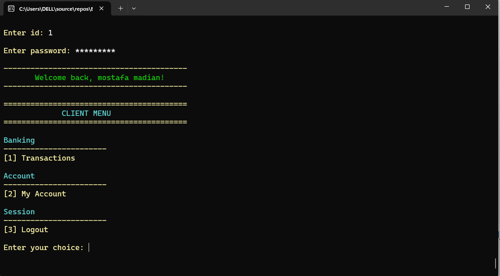

### Employee Dashboard
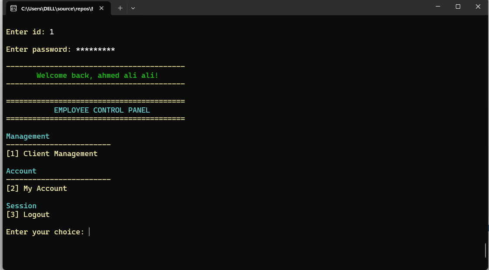

### Client Management
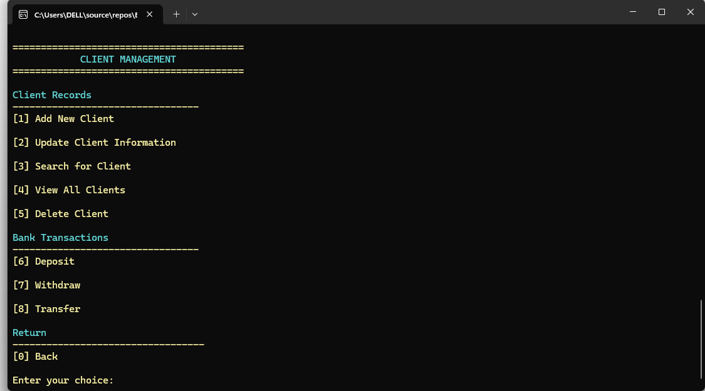

### Employee Management
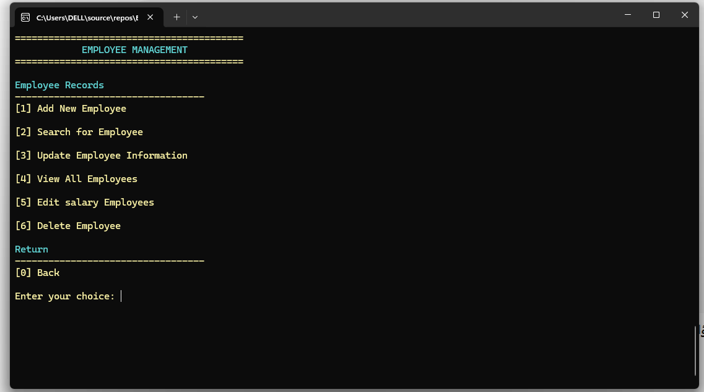

### Admin Management
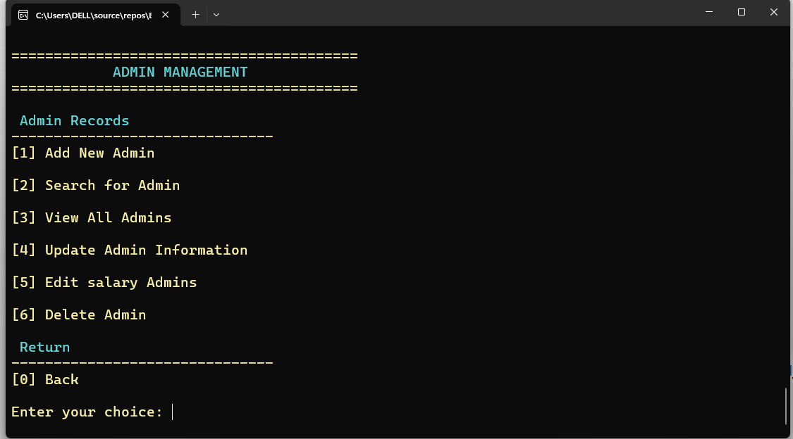

### My Account
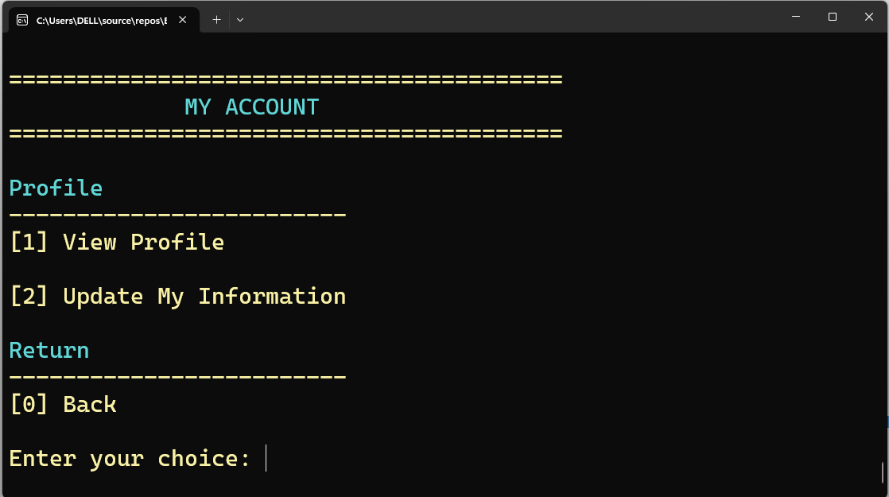

### Transactions
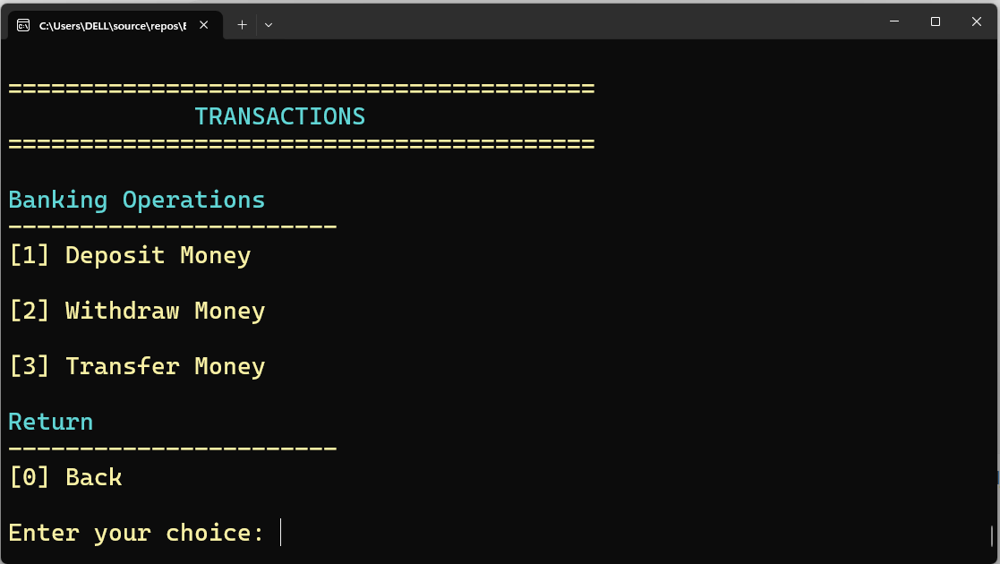

### Search
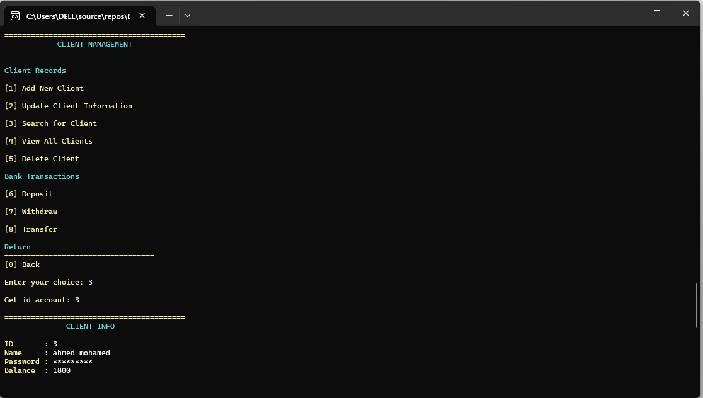

### Update Information
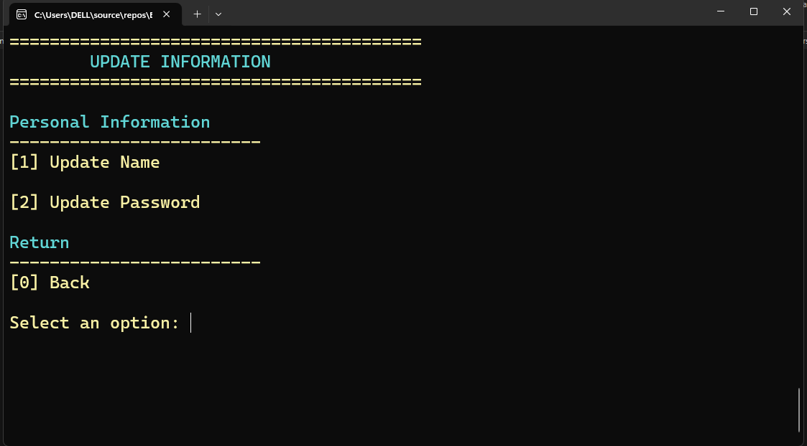

### Transfer Money
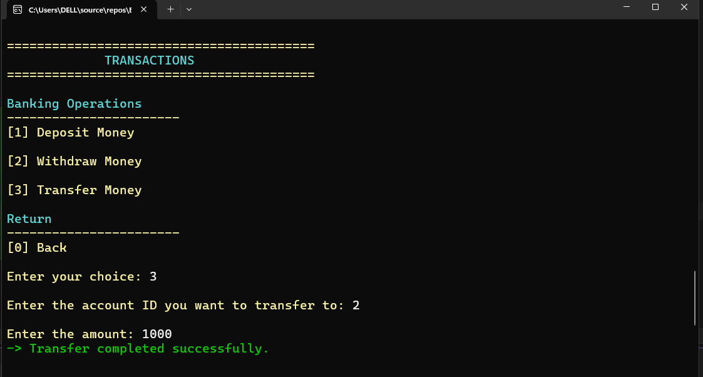

### Profile
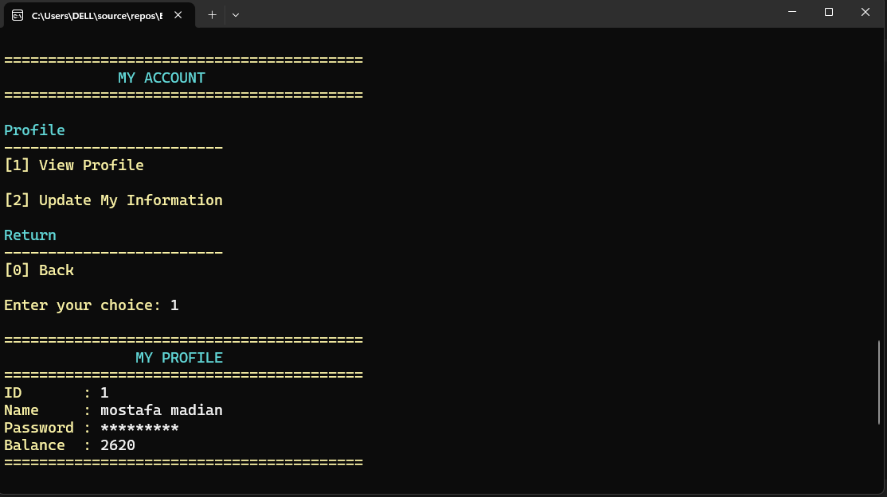

## 🚀 Getting Started

1. Clone the repository.
2. Open the solution in Visual Studio.
3. Build and run the project.

## 👨‍💻 Author

**Ahmed Reda**

---

This project was developed for educational purposes to practice C++, Object-Oriented Programming, and File Handling.
